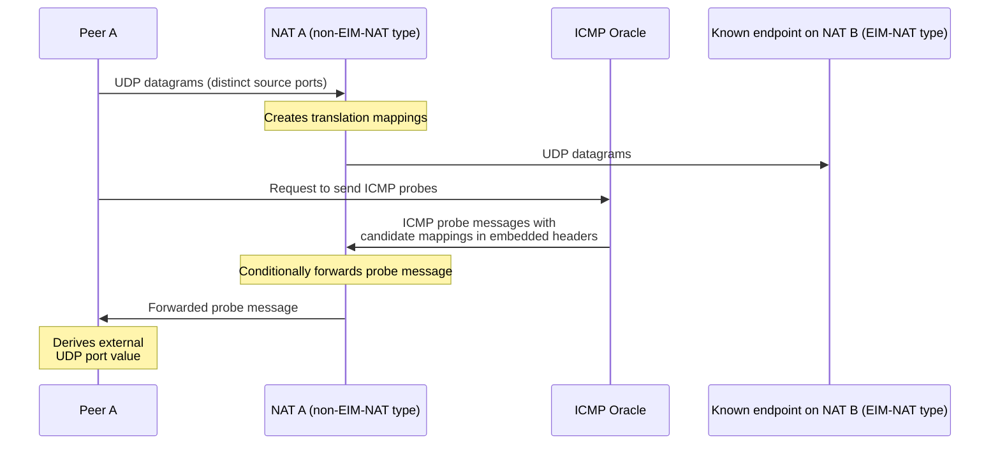

# A safer alternative to birthday-paradox NAT traversal

## Abstract

The NAT traversal problem is largely solved for many real-world cases.
Most NAT devices are of Endpoint-Independent Mapping type, making hole punching relatively straightforward.
A smaller set of NAT devices use less NAT-traversal-friendly behavior and assign external ports unpredictably.

If one NAT device in a pair behaves this way, establishing a direct connection may require a probabilistic method based on the birthday paradox, as explained in the Tailscale [blog article](https://tailscale.com/blog/how-nat-traversal-works).
However, this method is not widely used, probably because it requires suspicious-looking peer activity: one peer effectively performs port scanning against the other.
This document presents an alternative method for this case.

## NAT Types

As described in [RFC5128](https://www.rfc-editor.org/rfc/rfc5128.html), there are different types of NAT behaviours.
Two are of particular interest:

- **Endpoint-Independent Mapping (EIM-NAT):** The same external address and port are used when a client sends UDP packets from the same internal port to multiple different endpoints.
- **Non-Endpoint-Independent Mapping (non-EIM-NAT):** The external port[^1] may vary when the client sends UDP packets to different endpoints, even when using the same internal port.

For the purpose of this document, let's assume that both NAT devices have Endpoint-Dependent Filtering and require a full match on the 5-tuple[^2] to let traffic pass.

## Classic solution

This is described nicely in the [Tailscale blog article](https://tailscale.com/blog/how-nat-traversal-works), in the _The benefits of birthdays_ section.
With one exception: the part about 170,000 probes completely ignores the lifetime of translation state in NAT devices.
So it would not take 28 minutes and 2x170,000 probes.
In the harder case of two NATs with unpredictable port allocation, it is essentially impossible to establish a connection this way.

But for the easier case, with one NAT device of EIM-NAT type and one of non-EIM-NAT type, the birthday-paradox method works fine.
There is just one small problem that keeps the method largely theoretical.
The traffic pattern involved is essentially port scanning.
It can trigger firewalls and Intrusion Detection Systems, and can cause the peer IP to be blocked, for example.

## Safer alternative

The core of the presented method comes from the realisation that a NAT device considers some traffic to be _related_ to a connection, for example ICMP Time Exceeded (Type 11) and Destination Unreachable (Type 3) packets.
As explained in [RFC2663](https://datatracker.ietf.org/doc/html/rfc2663#section-3.3), such packets should be forwarded by the NAT device as long as the embedded headers match some translation mapping on that NAT device.
NAT devices should let those packets pass, because blocking them would break the traditional [traceroute](https://linux.die.net/man/8/traceroute) tool and, more importantly, the [Path-MTU Discovery](https://en.wikipedia.org/wiki/Path_MTU_Discovery) mechanism.

There is one more very important thing to say about those ICMP packets.
They *can be sent by any IP address on the Internet* and still be accepted by the NAT device.
By their nature, those packets do not have to come from either peer or from either NAT device, and may instead come from a third-party IP address.

Those facts allow some third system, let's call it an ICMP Oracle, to reveal the translation mapping on a NAT device without sending a single packet from the opposite peer.
When sending a probe message, the ICMP Oracle only needs to construct the message with proper embedded headers representing hypothetical packets that could be sent from the first peer towards the second peer, using the known endpoint on its EIM-NAT type device.
In addition to placing the tested transport-layer external port in the source port field of the embedded header, it needs to place the same value somewhere else, for example in the IP Identification field.
That field can then be extracted by the peer after the matching probe is let through by the NAT device, revealing the real external translation mapping port.

No port-scanning-like traffic at all, only a stream of ICMP probes from an ICMP Oracle IP.

A simple UDP case:



If Peer A sends 256 packets towards the NAT B endpoint known to be on an EIM-NAT type device, then the Oracle would need to send:
- 256 ICMP probes for a 64% success chance; and
- 1024 ICMP probes for a 98% success chance.

This is not a very large number for quite a high chance of revealing the exact mapping details on the non-EIM-NAT device.
Even if the unusual traffic triggers some IDS response, that would likely affect the ICMP Oracle IP and leave the peers unaffected.
Once the external port is revealed, all the information required to establish a direct connection between the peers is known.

## Contact

Please contact me if you are interested in implementing this method, especially in a commercial environment.

### Metadata

```yaml
title: A safer alternative to birthday-paradox NAT traversal
author: Rafał Kupka
email: r.kupson@gmail.com
date: 2026-05-22
```

[^1]: The external IP address can vary too, but it is less common.
[^2]: Protocol number and both source and destination addresses and ports.
