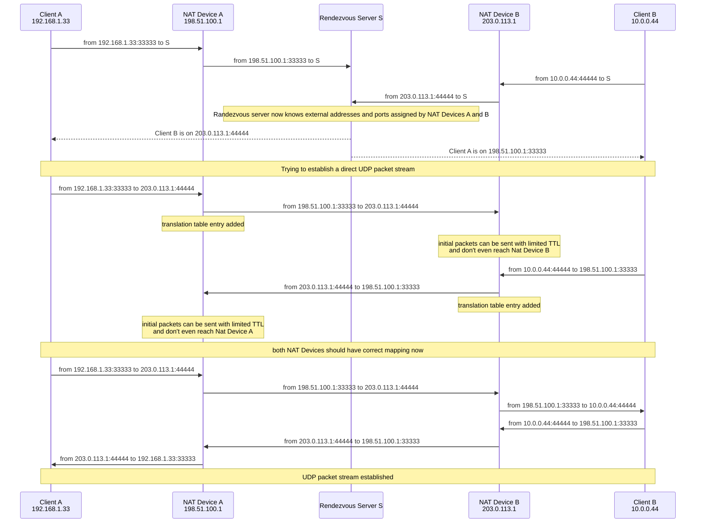
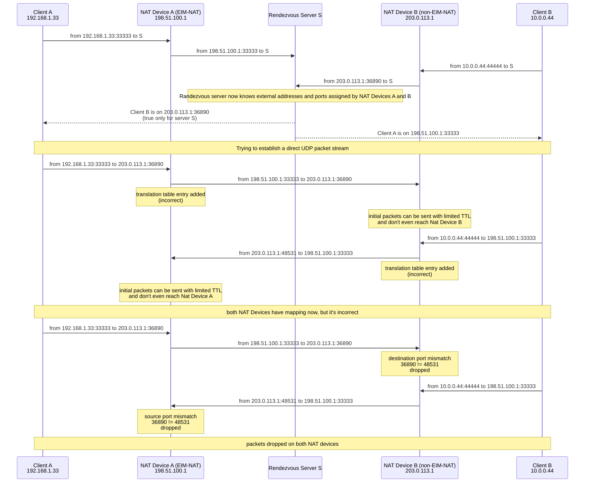
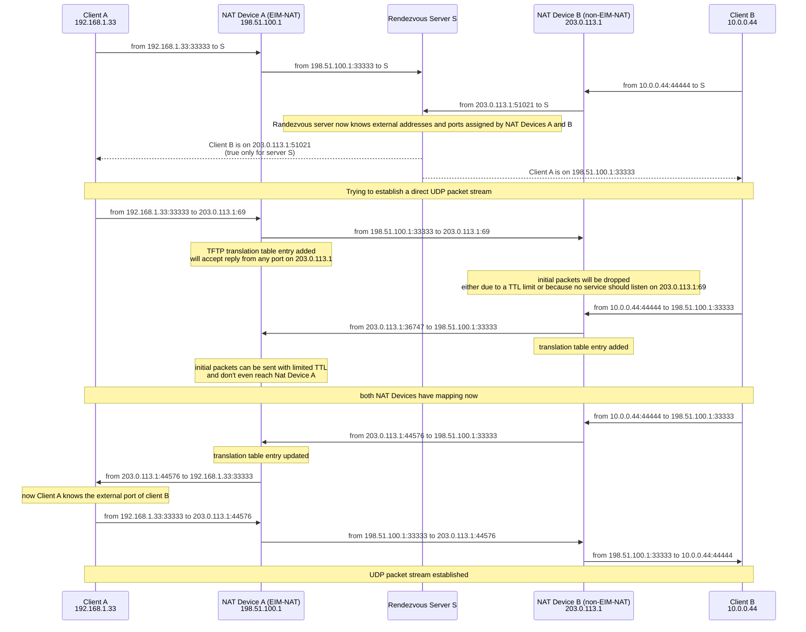

# TFTP-Assisted UDP NAT Hole Punching

## Abstract

This document describes an extension to the UDP NAT Hole Punching method for NAT traversal, as outlined in [RFC5128](https://www.rfc-editor.org/rfc/rfc5128.html).
On certain NAT devices, the [TFTP protocol](https://www.rfc-editor.org/rfc/rfc1350) Application Level Gateway (ALG) can be leveraged to significantly increase the success rate of establishing connections between peers.

## TFTP Application Level Gateway

Due to the simplicity of the [TFTP protocol](https://www.rfc-editor.org/rfc/rfc1350), ALGs implemented in NAT devices are typically not full TFTP protocol proxies but act merely as helpers that modify NAT translation behavior.

NAT devices that support the TFTP protocol will accept UDP responses to TFTP requests from *any* source port on the target IP address.

## NAT Types

As described in [RFC5128](https://www.rfc-editor.org/rfc/rfc5128.html), there are different types of NAT behaviors. Two are of particular interest:

- **Endpoint-Independent Mapping (EIM-NAT):** The same external address and port are used when a client sends UDP packets from the same internal port to multiple different endpoints.
- **Non-Endpoint-Independent Mapping (non-EIM-NAT):** The external port[^1] may vary when the client sends UDP packets to different endpoints, even when using the same internal port.

## Classic UDP Hole Punching

The UDP Hole Punching technique, as described in [RFC5128 §3.3](https://www.rfc-editor.org/rfc/rfc5128.html#section-3.3),
relies on both NAT devices being of the EIM-NAT type.



### Key Observations

Sending initial packets with a limited Time-To-Live (TTL) prevents the opposite NAT device from adding erroneous translation table entries—this can happen on some devices when receiving UDP packets for which no mapping exists yet.

Once a UDP packet stream is established, keep-alive packets must be sent periodically to prevent NAT devices from expiring the translation table entries.

## Failed UDP Hole Punching

Consider a scenario where one peer is behind an EIM-NAT and the other behind a non-EIM-NAT device, which assigns a random external port per endpoint.



### Key Observations

Client A may still attempt to establish a direct UDP packet stream by guessing the external port of Client B. However:

- Sending too many guesses quickly can stress NAT B (CPU load, translation table overflows, bandwidth).
- Sending guesses too slowly risks expiration of the required translation table entries.

A useful technique to reduce this impact, based on [the birthday paradox](https://en.wikipedia.org/wiki/Birthday_problem) is described in [How NAT traversal works](https://tailscale.com/blog/how-nat-traversal-works) on Tailscale blog.

## TFTP-Assisted UDP Hole Punching

Now consider the case where NAT A supports TFTP ALG and is EIM-NAT, while NAT B is non-EIM-NAT. The well-known port for TFTP protocol is UDP/69.



### Key Observations

Sending a single packet to port 69 on the peer's external IP address allows NAT A to create a more permissive translation table entry due to the TFTP ALG behavior.

This method can be combined with the classic approach by sending an additional UDP packet to port 69, ideally after a short timeout if standard hole punching fails.

## Applications

The utility of this method depends largely on the prevalence of NAT devices with TFTP ALG enabled. Some data suggests that certain DSL routers shipped by ISPs include this feature enabled by default.
Further data collection is needed to assess the general viability of this technique for enhancing peer-to-peer connectivity.

However, due to the low complexity and minimal cost associated with the described method, it could still be useful even if only a minority of residential routers—e.g., one in several—have TFTP ALG enabled.

---

### Metadata

```yaml
title: TFTP-Assisted UDP NAT Hole Punching
author: Rafał Kupka
email: r.kupson@gmail.com
date: 2025-06-09
```

[^1]: External IP address can vary too but it's less common.
