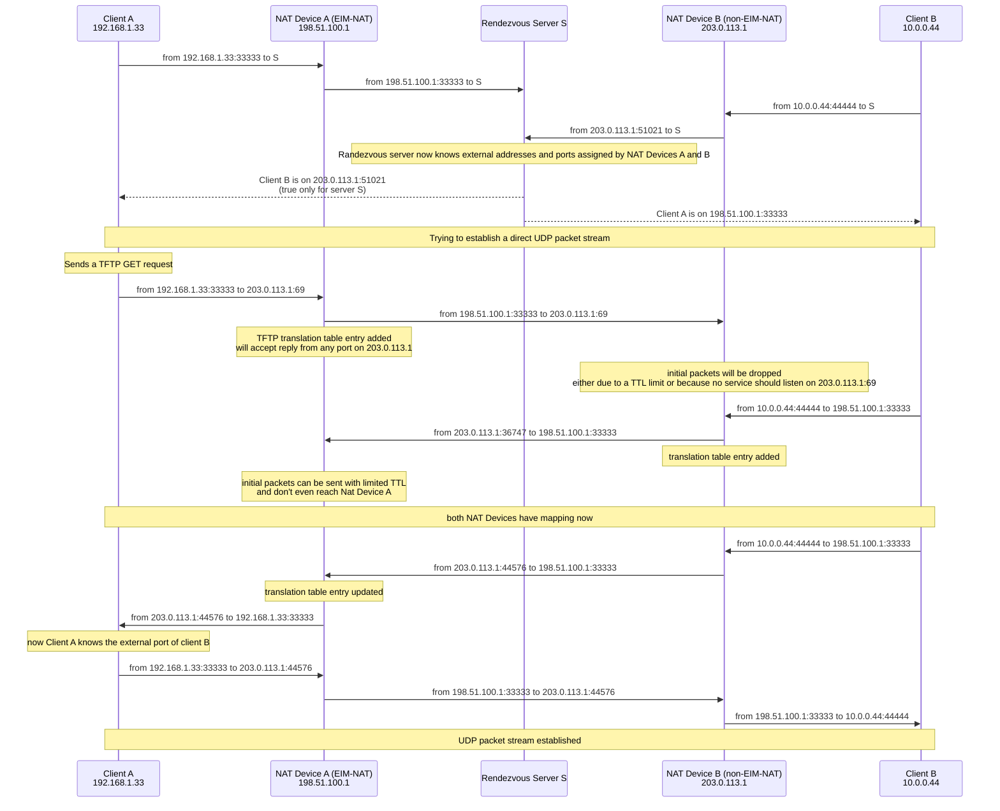

# TFTP-Assisted UDP NAT Hole Punching

## Abstract

This document describes an extension to the UDP NAT Hole Punching method for NAT traversal, as outlined in [RFC5128](https://www.rfc-editor.org/rfc/rfc5128.html).
On certain NAT devices, the [TFTP protocol](https://www.rfc-editor.org/rfc/rfc1350) Application Level Gateway (ALG) can be leveraged to significantly increase the success rate of establishing connections between peers.

## TFTP Application Level Gateway

Due to the simplicity of the [TFTP protocol](https://www.rfc-editor.org/rfc/rfc1350), ALGs implemented in NAT devices are typically not full TFTP protocol proxies but act merely as helpers that modify NAT translation behaviour.

NAT devices that support the TFTP protocol will accept UDP responses to TFTP requests from *any* source port on the target IP address.

## NAT Types

As described in [RFC5128](https://www.rfc-editor.org/rfc/rfc5128.html), there are different types of NAT behaviours. Two are of particular interest:

- **Endpoint-Independent Mapping (EIM-NAT):** The same external address and port are used when a client sends UDP packets from the same internal port to multiple different endpoints.
- **Non-Endpoint-Independent Mapping (non-EIM-NAT):** The external port[^1] may vary when the client sends UDP packets to different endpoints, even when using the same internal port.

## Classic UDP Hole Punching

The UDP Hole Punching technique, as described in [RFC5128 §3.3](https://www.rfc-editor.org/rfc/rfc5128.html#section-3.3),
relies on both NAT devices being of the EIM-NAT type.


### Key Observations

Sending initial packets with a limited Time-To-Live (TTL) prevents the opposite NAT device from adding erroneous translation table entries—this can happen on some devices when receiving UDP packets for which no mapping exists yet.

Once a UDP packet stream is established, keep-alive packets must be sent periodically to prevent NAT devices from expiring the translation table entries.

## Failed UDP Hole Punching

Consider a scenario where one peer is behind an EIM-NAT and the other behind a non-EIM-NAT device, which assigns a random external port per endpoint.


### Key Observations

Client A may still attempt to establish a direct UDP packet stream by guessing the external port of Client B. However:

- Sending too many guesses quickly can stress NAT B (CPU load, translation table overflows, bandwidth).
- Sending guesses too slowly risks expiration of the required translation table entries.

A useful technique to reduce this impact, based on [the birthday paradox](https://en.wikipedia.org/wiki/Birthday_problem) is described in [How NAT traversal works](https://tailscale.com/blog/how-nat-traversal-works) on Tailscale blog.

## TFTP-Assisted UDP Hole Punching

Now consider the case where NAT A supports TFTP ALG and is EIM-NAT, while NAT B is non-EIM-NAT. The well-known port for TFTP protocol is UDP/69.



### Key Observations

Sending a single packet to port 69 on the peer's external IP address allows NAT A to create a more permissive translation table entry due to the TFTP ALG behaviour.

This method can be combined with the classic approach by sending an additional UDP packet to port 69, ideally after a short timeout if standard hole punching fails.

### Live Example

Let's have two hosts: `m` and `s`, and see the responses they received from STUN servers:

```
root@m:~# stuntest
stun.l.google.com:19302 for 0.0.0.0:54166 returns address: 90.199.252.188:54166
stun.cloudflare.com:3478 for 0.0.0.0:54166 returns address: 90.199.252.188:54166
stun.ekiga.net:3478 for 0.0.0.0:54166 returns address: 90.199.252.188:54166
stun.voipbuster.com:3478 for 0.0.0.0:54166 returns address: 90.199.252.188:54166
stun.voipstunt.com:3478 for 0.0.0.0:54166 returns address: 90.199.252.188:54166

root@s:~# stuntest
stun.l.google.com:19302 for 0.0.0.0:57020 returns address: 82.132.229.58:19581
stun.cloudflare.com:3478 for 0.0.0.0:57020 returns address: 82.132.229.58:20524
stun.ekiga.net:3478 for 0.0.0.0:57020 returns address: 82.132.229.58:21569
stun.voipbuster.com:3478 for 0.0.0.0:57020 returns address: 82.132.229.58:23908
stun.voipstunt.com:3478 for 0.0.0.0:57020 returns address: 82.132.229.58:15340
```

As we see the `m` host is behind an EIM-NAT and the `s` struggles behind a non-EIM-NAT.

The `tftptest` tool implements a client for STUN-like protocol on top of TFTP[^2]:

```
root@m:~# tftptest
157.245.47.226:69 for 0.0.0.0:50694 returns address: 90.199.252.188:50694
207.154.212.211:69 for 0.0.0.0:50694 returns address: 90.199.252.188:50694
```

The `m` host received replies from TFTP servers (in endpoint-independend manner) -- the TFTP ALG is enabled.

Now let's use the `hping3` tool to try to punch a hole throught both NAT devices.

In `/tmp/tftp-get.dat` file we have a TFTP GET request packet content:

```
b'\x00\x01v1_tftp_udp_32000\x00octet\x00'
```

The `v1_tftp_udp_32000` is just an example filename.

Sending the TFTP GET request from port 32000[^3]:

```
root@m:~# hping3 --verbose --numeric \
    --count 1 --ttl 2 --udp \
    --keep --baseport 32000 --destport 69 \
    --file /tmp/tftp-get.dat -d $(wc -c /tmp/tftp-get.dat | sed 's/ .*$//') \
    82.132.229.58
```

That should be enought to make a special translation table entry, and now the `s` can send packets back to `m`:

```
root@s:~# hping3 --verbose --numeric --udp \
    --keep --baseport 31234 --destport 32000 \
    90.199.252.188
```

With the `tcpdump` (executed on the WAN interface of `m` host) we can see that a UDP packet stream is established:

```
09:18:38.363519 IP (tos 0x0, ttl 2, id 50569, offset 0, flags [none], proto UDP (17), length 54)
    192.168.0.6.32000 > 82.132.229.58.69: TFTP, length 26, RRQ "v1_tftp_udp_32000" octet
09:18:45.770469 IP (tos 0x0, ttl 49, id 39975, offset 0, flags [none], proto UDP (17), length 28)
    82.132.229.58.19479 > 192.168.0.6.32000: UDP, length 0
09:18:46.734972 IP (tos 0x0, ttl 49, id 14548, offset 0, flags [none], proto UDP (17), length 28)
    82.132.229.58.19479 > 192.168.0.6.32000: UDP, length 0
09:18:47.774737 IP (tos 0x0, ttl 49, id 37179, offset 0, flags [none], proto UDP (17), length 28)
    82.132.229.58.19479 > 192.168.0.6.32000: UDP, length 0
```

The packets from `s` are incoming from source port `19479`, the `m` can reach `s` if it sends packets to that port:

```
root@m:~# hping3 --verbose --numeric --udp \
    --keep --baseport 32000 --destport 19479 \
    82.132.229.58
using br-wan, addr: 192.168.0.6, MTU: 1500
HPING 82.132.229.58 (br-wan 82.132.229.58): udp mode set, 28 headers + 0 data bytes
len=46 ip=82.132.229.58 ttl=49 id=55099 tos=0 iplen=28
seq=0 rtt=588.3 ms
DUP! len=46 ip=82.132.229.58 ttl=49 id=8287 tos=0 iplen=28
seq=0 rtt=1548.3 ms
```

## Applications

This can potentially be used to improve connectivity in various Peer-to-Peer situations such as some VPNs (like Tailscale) or WebRTC applications.

The utility of this method depends largely on the prevalence of NAT devices with TFTP ALG enabled. Some data suggests that certain DSL routers shipped by ISPs include this feature enabled by default.
Further data collection is needed to assess the general viability of this technique for enhancing peer-to-peer connectivity.

However, due to the low complexity and minimal cost associated with the described method, it could still be useful even if only a minority of residential routers—e.g., one in several—have TFTP ALG enabled.

---

### Metadata

```yaml
title: TFTP-Assisted UDP NAT Hole Punching
author: Rafał Kupka
email: r.kupson@gmail.com
date: 2025-06-09
```

[^1]: External IP address can vary too but it's less common.
[^2]: Send TFTP GET request, receive DATA packet with observed external IP address and port number.
[^3]: This device is behind an EIM-NAT that prefers to keep the source port intact so we can assume the external port will be 32000 too. This is not a requirement for this method to work but it makes the `hping3` example easier to show.
