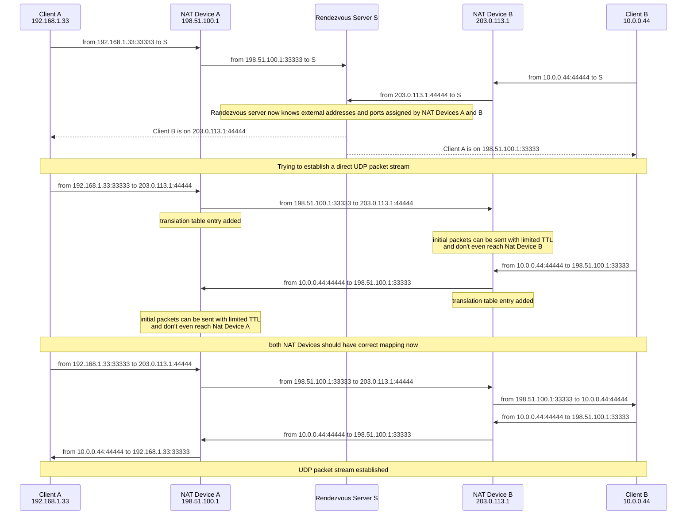
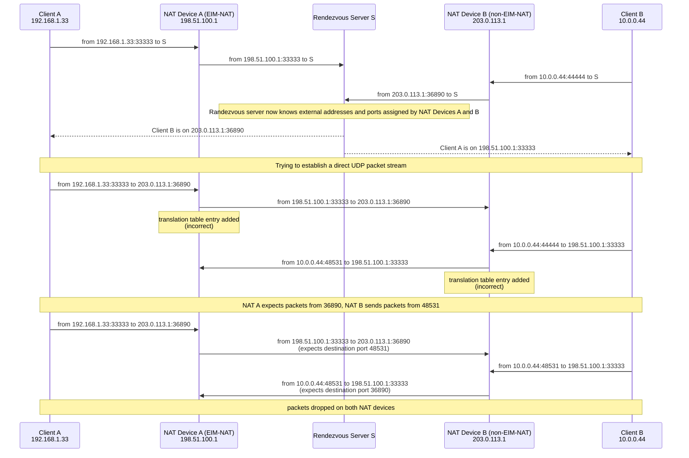

# TFTP assisted UDP NAT Hole Punching

## Abstract

This document describes an extension to the UDP NAT Hole Punching method of NAT Traversal described in [RFC5128](https://www.rfc-editor.org/rfc/rfc5128.html).
On some NAT devices the [TFTP protocol](https://www.rfc-editor.org/rfc/rfc1350) Application Level Gateway (ALG) can be used to greatly increase ability to connect to remote peers.

## TFTP Application Level Gateway

Due to simplicity of the [TFTP protocol](https://www.rfc-editor.org/rfc/rfc1350) the ALG in devices performing NAT is typically not a full TFTP protocol proxy but merely a helper to the connection tracking code.

NAT devices compatible with TFTP protocol do accept UDP packet reply to TFTP request from *any* port of the target IP.

## NAT types

The [RFC5128](https://www.rfc-editor.org/rfc/rfc5128.html) document describes different NAT types. Two important for us will be:

- Endpoint-Independent Mapping type (EIM-NAT) - The same external address and port is used when given client port is used to send UDP packets to multiple different endpoints.
- Non Endpoint-Independent Mapping type (non-EIM-NAT) - The external address may stay the same but the external port will be different when the same client port will be used to send UDP packets to different endpoints.

## Classic UDP Hole Punching

The UDP Hole Punching NAT Traversal method as described in 
[RFC5128 3.3.](https://www.rfc-editor.org/rfc/rfc5128.html#section-3.3)
requires both-end NAT Devices to be Endpoint-Independent Mapping type (EIM-NAT).

Sending initial packets with limited Time-To-Live prevents the opposite NAT device from adding erroreus translation table entries.
This can happen on some devices when they receive a UDP packet without existing translation table entry.

Once established the UDP packet stream would need to kept alive by sending keep-alive packets. That should prevent NAT Devices from removing the needed transation table entries.

## Failed UDP Hole Punching

Let's examine the scenario where one of the NAT devices is still a EIM-NAT type but the peer is a non-EIM-NAT type device that pick random port for each endpoint.

In this case the Client A can still try to establish a direct UDP stream to Client B by guessing correct port number in translation table on NAT Device B. This will take time and will require maybe thausends of packets to be sent to NAT Device B.
If Client A will send those packets quickly that may stress NAT device B - overflow of translation table, higher CPU usage due to flood of UDP packets, bandwidtch exhaustion could be a problem. Sending those guessing packets slowly can cause the correct translation table entry (on NAT B) to be removed due to timeout before Client A would be able to guess it.

